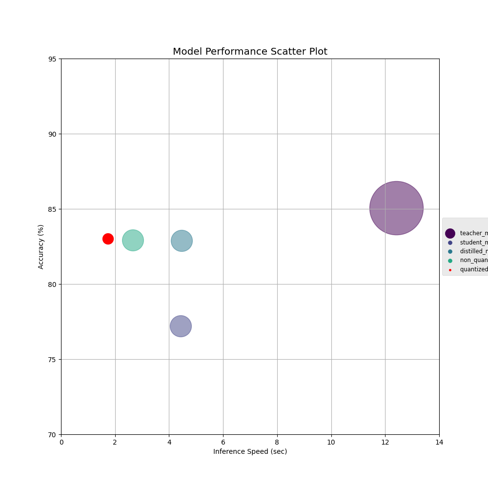

# Optimizing Sentence Transformer Models for Few-Shot Text Classification

## Project Title
Optimizing Sentence Transformer Models for Few-Shot Text Classification

## Team Members
- Harinder Singh Mashiana (hm3008)
- Mohini Bhave (mb5157)

## Overview
This project aims to enhance the efficiency of Sentence Transformer models by employing advanced techniques such as knowledge distillation and quantization. These methodologies are intended to reduce the model size and improve inference speed, making the models more suitable for deployment in resource-constrained environments. We focus on optimizing these models specifically for few-shot text classification tasks, demonstrating significant improvements in performance metrics.


# Repository Structure and Running Instructions

## Folder Structure
This repository is organized into several directories, each serving a distinct role in the project setup:

- **/evaluator**: Contains `benchmark.py`, a module for evaluating model performance metrics such as accuracy, inference speed, and size.
- **/plots**: Includes `plot.py`, which houses functions for visualizing performance comparisons and other relevant data insights.
- **/training**: Holds training scripts such as `student_train.py` and `teacher_train.py` which manage the training of the student and teacher models respectively.
- **/trainer**: Scripts for the distillation process are kept here, including `distillation.py` for applying knowledge distillation techniques.
- **/model**: Contains ONNX model conversion and quantization scripts, such as `onnx_model.py` and `quantization.py`, which are crucial for optimizing model deployment.

### Key Files
- **main.py**: The main executable script that orchestrates model training, distillation, evaluation, and plotting results.
- **README.md**: Provides comprehensive documentation of the project setup, objectives, and instructions.
- **requirements.txt**: Lists all the Python dependencies required for the project.
- **results.json**: Stores the output from model evaluations which are used by plotting scripts to visualize data.

## Running the Code

### Prerequisites
Ensure that all dependencies are installed by running:
```bash
pip install -r requirements.txt
```
### Executing Main Script

To train models, perform distillation, convert models to ONNX format, apply quantization, and evaluate the models, execute the following command:

```bash
python main.py
```
This script will automatically handle the workflows defined in the training, distillation, and evaluation modules, ensuring a seamless operation from start to finish.

### Visualizing Results

To generate plots from the results obtained in results.json, run the following command:
```bash
python plots/plot.py
```
This will invoke the plotting functions defined within plot.py, which will read the evaluation metrics from results.json and render various comparative plots to provide visual insights into model performance.

### Using the Benchmark Module

The benchmark.py script located in the /evaluator folder is used within main.py to compute performance metrics such as accuracy, inference speed, and model size. This module can also be imported into other scripts if benchmarking is required in different parts of the project.

```bash
from evaluator.benchmark import ModelBenchmark
```

## Demo
To demonstrate the practical applications and benefits of our optimized models, we have developed an interactive demo hosted on Hugging Face Spaces. This demo visually compares the performance of the standard student model against the optimized quantized, distilled model.

### Interactive Demo Features:
- **Live Performance Metrics**: Users can input a text prompt and see real-time comparisons of inference speed and accuracy between the standard and optimized models.
- **Visualization of Results**: The demo includes graphs that display the accuracy and inference times, providing a clear, visual representation of the benefits of our optimizations.
- **User Interaction**: Users are encouraged to test different text prompts to explore how the models perform with various types of input.

Visit our demo here: [Optimized Models Demo](https://huggingface.co/spaces/hsmashiana/HPML_proj)

This interactive platform is designed to showcase the efficiency improvements in real-world scenarios, making it easier for stakeholders to evaluate the potential of these optimized models in production environments.

## Approach and Implementation

### Techniques Employed

#### Knowledge Distillation
In our project, knowledge distillation involves a teacher-student model architecture, where a more complex and larger "teacher" model imparts knowledge to a more compact "student" model.

**Methodology**:
1. **Training the Teacher**: Initially, the teacher model is fine-tuned on a specific task to achieve high performance. This model sets the performance benchmark for the student.
2. **Distillation Process**: The student model trains not only to match the final output labels but also to mimic the softer probabilities (softmax outputs) from the teacher model. This is achieved by employing a distillation-specific loss function.
3. **Loss Functions**:
   - **Cross-Entropy Loss**: Targets the accuracy of the student model on the actual task labels.
   - **Distillation Loss (Kullback-Leibler divergence)**: Ensures the student model's output distribution closely approximates that of the teacher model.

#### Quantization
We apply post-training dynamic quantization to the student model, converting numerical parameters from floating-point to lower-bit integers, reducing memory usage and accelerating inference times.

**Methodology**:
1. **Model Conversion**: Convert the trained student model into a format suitable for quantization, such as ONNX.
2. **Quantization Application**: Using tools like ONNX Runtime, apply dynamic quantization to reduce the model's weight precision effectively.

#### Performance Benchmarking
Our project uses a suite of benchmarks to assess the optimized models against traditional models, focusing on text classification tasks.

**Metrics**:
- **Accuracy**: The percentage of correct predictions made by the model.
- **Inference Speed**: The time taken by the model to process inputs and make predictions.
- **Model Size**: The total disk space occupied by the model.

### Implementation Details

#### Model Training
- **SetFitModel**: Adapted Sentence Transformer models configured for SetFit, utilized as both teacher and student in our distillation strategy.
- **Training Scripts**: Custom scripts manage model training, ensuring both teacher and student models are optimally prepared for the distillation process.

#### Model Distillation
- **SetFitDistillationTraining**: A customized training regimen where the student model learns from the teacher through both traditional and distillation loss functions.
- **Implementation**: We enhance the standard training loop to integrate the calculation and application of the distillation loss.

#### ONNX Conversion and Quantization
- **ONNX Conversion**: The trained models are converted to ONNX format to facilitate interoperability and flexibility.
- **Dynamic Quantization**: Post-conversion, the models undergo dynamic quantization to utilize 8-bit integers for weights, reducing their precision but preserving essential performance characteristics.

#### Performance Evaluation
- **Benchmark Suite**: A comprehensive evaluation setup measures accuracy, speed, and size across the original and optimized models, ensuring that the enhancements are beneficial.

These detailed methodologies underscore our commitment to advancing the efficiency of machine learning models through innovative techniques, setting a new standard for model performance in resource-constrained environments.

## Conclusion

Our project successfully demonstrates that employing techniques like knowledge distillation and quantization can significantly enhance the efficiency of Sentence Transformer models, particularly for few-shot text classification tasks. The following graph illustrates the comparative performance of the models in terms of accuracy and inference speed:



### Analysis of Results

From the graph:
- **Teacher Model**: While the teacher model shows high accuracy, its inference speed (latency) is the slowest among the models tested.
- **Student Model**: The student model, trained without distillation or quantization, offers a slight improvement in inference speed but at a cost to accuracy.
- **Distilled Model**: The distilled model achieves a balance between the teacher and student models, maintaining high accuracy with improved inference speed.
- **Quantized ONNX Model**: After applying quantization, this model demonstrates a substantial reduction in latency while retaining accuracy comparable to the teacher model. This showcases the effectiveness of quantization in reducing computational overhead without a significant loss in performance.

### Key Takeaways

- **Reduced Model Size and Faster Inference**: Through quantization and knowledge distillation, we achieved notable reductions in model size and inference time without a substantial compromise in accuracy.
- **Enhanced Deployment Capability**: The optimizations make these models ideal for deployment in environments with stringent resource constraints, such as mobile devices or embedded systems.
- **Scalable and Adaptable Framework**: The methodologies and frameworks developed are versatile and can be adapted to various NLP tasks and different model architectures.

Through this project, we have laid a foundation for future explorations into model optimization techniques that do not sacrifice performance for efficiency. Our results encourage the adoption of these optimized models in practical applications, promising significant improvements in operational efficiency and usability in constrained environments.